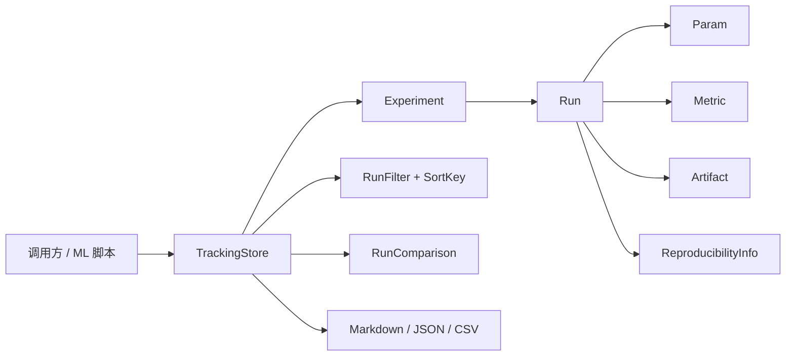

# MoonTrack 项目总览

> 本文档是 MoonTrack 的项目级记忆，用于代码审阅、比赛验收、后续开发和版本发布。

## 1. 项目状态快照

| 项目 | 当前状态 |
|---|---|
| 模块名 | `AlexenderSokolov/moontrack` |
| 当前版本 | `0.1.0` |
| 主要语言 | MoonBit |
| 许可证 | Apache-2.0 |
| GitHub | https://github.com/AlexenderSokolov/moontrack |
| Mooncakes | 待发布至 mooncakes.io |
| 测试 | 129 项测试通过 |
| CLI 工具 | demo, track, query, bench |

## 2. 问题背景与设计目的

MoonTrack 来自机器学习工作流中反复遇到的问题：实验元数据散落在日志文件、电子表格和聊天记录中。MoonTrack 把这一小但关键的层抽成独立库。

**可验证的实验追踪 + 可查询的运行历史 + 可比较的指标分析。**

MoonTrack 不负责调用模型、执行 shell、管理密钥或运行分布式调度。它是上层实验管理系统的"追踪层"，不是完整实验平台。

## 3. 系统架构



### 3.1 数据模型

- `Experiment`：实验容器，包含 id、name、description、tags、created_at、runs、metadata。
- `Run`：单次运行，包含 id、experiment_id、status、start_time、end_time、parameters、metrics、artifacts、tags、reproducibility、notes、error_message。
- `Param`：参数键值对，包含 key、value、type_（int/float/bool/string）、description。
- `Metric`：指标键值对，包含 key、value、step、timestamp、direction、threshold。
- `Artifact`：产物，包含 name、path、size、checksum、metadata。
- `ReproducibilityInfo`：可复现性信息，包含 code_version、command、environment、random_seed、dependencies。

### 3.2 生命周期模型

```
Created → Running → Completed
                   → Failed → Running (retry)
                   → Killed
```

### 3.3 查询模型

- `RunFilter`：组合过滤器，支持 status、tags、params、metric range，AND 语义。
- `SortKey`：按指标值或参数值排序，支持升序和降序。

### 3.4 比较模型

- `RunComparison`：选定基准 Run，计算其他 Run 的指标差值。
- `MetricDelta`：包含绝对差值、百分比变化和改善/恶化判断。
- 改善判断基于 direction：HigherBetter 时 comparison > baseline 为改善；LowerBetter 时 comparison < baseline 为改善；None 时不做判断。

## 4. 开发、验收与发布流程

### 本地开发

```bash
moon fmt --check
moon info
git diff --exit-code -- '*.mbti'
moon check --deny-warn
moon build --deny-warn
moon test --deny-warn
moon run cmd/demo
moon run cmd/track
moon run cmd/query
moon run cmd/bench
```

### 每次改动的验收顺序

1. 运行 `moon fmt --check`。
2. 运行 `moon info`，并用 `git diff --exit-code -- '*.mbti'` 确认生成接口文件已同步。
3. 运行 `moon check --deny-warn`。
4. 运行 `moon build --deny-warn`。
5. 运行完整 `moon test --deny-warn`。
6. 运行 `moon run cmd/demo`、`moon run cmd/track`、`moon run cmd/query`、`moon run cmd/bench`。

### 版本发布

1. 确认版本号符合语义化版本规则。
2. 更新 `CHANGELOG.md` 和 README 中的版本信息。
3. 执行 `moon publish --dry-run` 并检查打包文件列表。
4. 经项目负责人明确同意后执行 `moon publish`。
5. 验证 Mooncakes 页面和干净环境安装。

## 5. 当前验收标准

- `moon fmt --check` 通过。
- `moon info` 通过，且生成的 `pkg.generated.mbti` 无未提交差异。
- `moon check --deny-warn` 无错误或警告。
- `moon build --deny-warn` 显式构建通过。
- `moon test --deny-warn` 全部通过，当前基线为 49 项。
- `moon run cmd/demo` 输出 Markdown、JSON、比较、查询和 CSV。
- `moon run cmd/track` 输出追踪、JSON 和比较。
- `moon run cmd/query` 输出查询、排序和 CSV。
- `moon run cmd/bench` 输出基准测试摘要。
- README、API、设计、路线图、CHANGELOG 和本文档描述一致。
